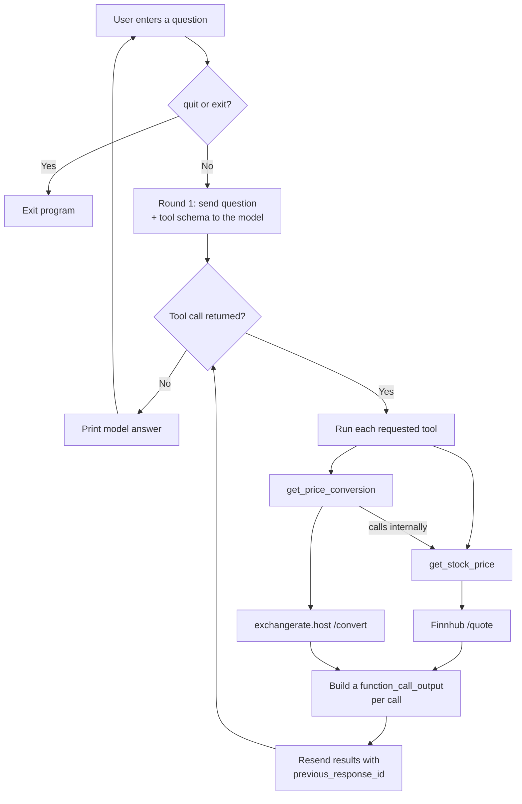
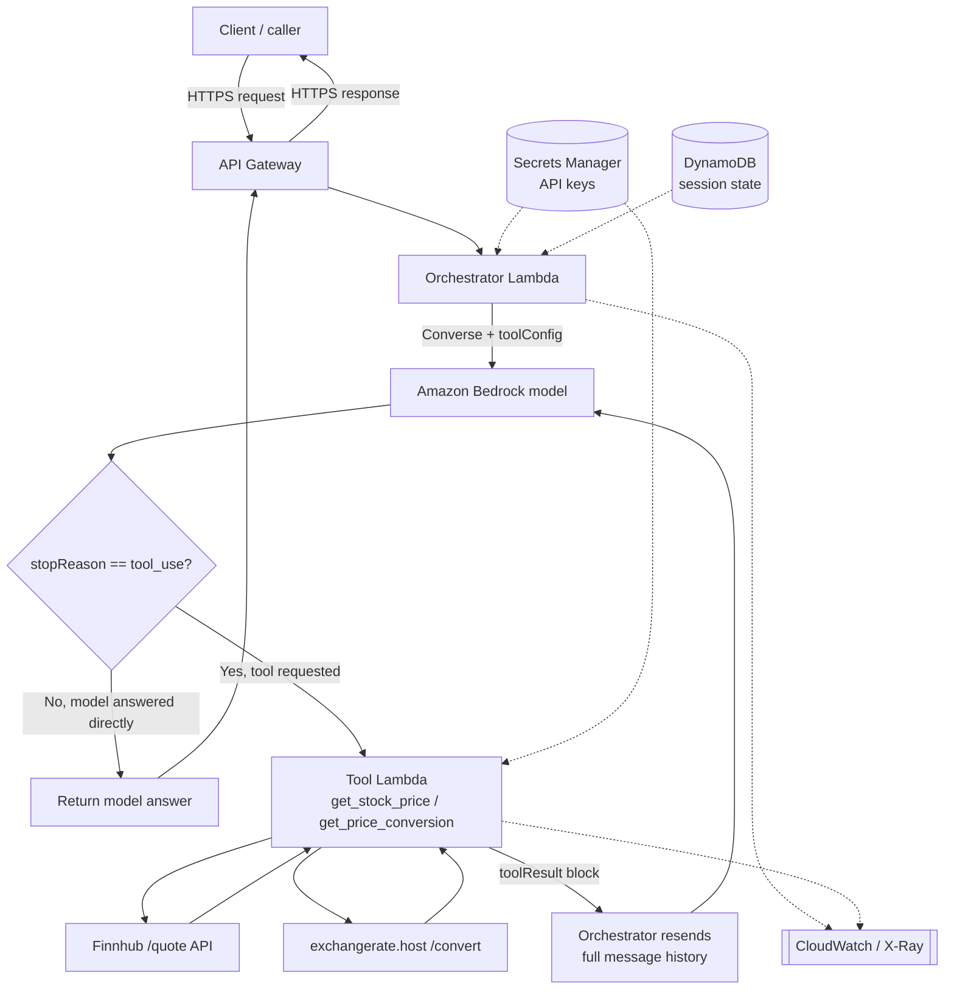
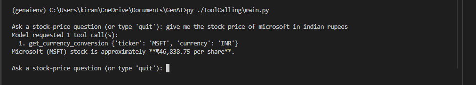

# Stock Price Tool Calling

A command-line example of tool calling with the OpenAI Responses API. You ask
stock-price questions in a loop; the model decides which tool (if any) it needs,
the script fetches live prices from Finnhub and — when another currency is
requested — converts them through exchangerate.host, and the results are sent
back to the model so it can answer in plain language.

## Features

- Interactive loop that handles multiple questions in one run
- Two tools: live USD stock prices, plus on-demand currency conversion
- Function calling via the OpenAI Responses API
- Multi-round tool loop — keeps calling tools until the model returns plain text
- Live prices from Finnhub; currency conversion from exchangerate.host
- Handles multiple function calls in a single model response
- Correct `function_call_output` and `call_id` handling
- Graceful handling of network errors, `Ctrl+C`, and `quit` / `exit`

## Architecture



### Request flow

1. The user asks something like `Give me Microsoft's price in Indian rupees`.
2. `main.py` sends the question and the tool schema to the Responses API.
3. The model picks a tool: `get_stock_price` for a plain USD price, or `get_price_conversion` when another currency is requested.
4. The script runs each requested call locally. `get_price_conversion` calls `get_stock_price` internally, then converts the USD figure through exchangerate.host.
5. The script returns one `function_call_output` per call (each carrying its `call_id`) and resends them with `previous_response_id`.
6. Steps 3–5 repeat until the model stops requesting tools — this is the multi-round loop.
7. The model produces the final, readable answer.

## Code walkthrough

The whole program is one file, `main.py`. Here are the pieces that matter, in the
order the diagram follows.

### The tools

Two functions are callable. `get_stock_price` fetches a USD quote from Finnhub:

```python
def get_stock_price(ticker):
    try:
        response = requests.get(
            "https://finnhub.io/api/v1/quote",
            params={"symbol": ticker.upper(), "token": FINNHUB_API_KEY},
            timeout=10,                 # don't hang forever on a slow network
        )
        response.raise_for_status()     # turn 401/429/500 into exceptions
        data = response.json()

        price = data.get("c")           # "c" = current price
        if not price:                   # Finnhub returns 0 for unknown symbols
            return "Ticker not found"
        return price
    except requests.RequestException as e:
        return f"Error fetching price: {e}"
```

`get_price_conversion` reuses it: it calls `get_stock_price` first, then converts
the USD price to the requested currency through exchangerate.host:

```python
def get_price_conversion(ticker, currency):
    price = get_stock_price(ticker)     # <-- ordinary Python call to the tool above
    if isinstance(price, str):          # a str means it returned an error message
        return price

    try:
        response = requests.get(
            "https://api.exchangerate.host/convert",
            params={
                "access_key": EXCHANGERATE_API_KEY,
                "from": "USD",
                "to": currency.upper(),
                "amount": price,
            },
            timeout=10,
        )
        response.raise_for_status()
        data = response.json()
        # On failure the API returns {"success": false, ...} with a 200 status,
        # so check the body, not just the HTTP code.
        if not data.get("success", True) or data.get("result") is None:
            return f"Error converting price to {currency}: {data.get('error', 'no result')}"
        return data.get("result")
    except requests.RequestException as e:
        return f"Error converting price: {e}"
```

**Why the conversion tool nests the price tool.** `get_price_conversion` does not
ask the model to fetch the price first — its very first line calls
`get_stock_price` directly in Python. So a currency question is a *single* tool
call from the model's point of view, but *two* HTTP calls under the hood (Finnhub,
then exchangerate.host). Bundling the dependency inside one tool means the model
asks one question and gets one finished answer, instead of having to orchestrate
"get the price, then convert it" across two separate rounds.

### The tool schema

Both tools are described so the model can tell them apart. The deciding phrase is
"use this tool when the user asks for a stock price in a currency other than USD":

```python
my_tools = [
    {
        "type": "function",
        "name": "get_stock_price",
        "description": (
            "Get the latest live stock price in USD for a publicly traded company. "
            "Use this tool when the user asks for a current stock price and does "
            "not request conversion to another currency. Pass the exchange ticker "
            "symbol, such as MSFT for Microsoft or AAPL for Apple."
        ),
        "parameters": {
            "type": "object",
            "properties": {
                "ticker": {
                    "type": "string",
                    "description": "The company's exchange ticker symbol, not its full name.",
                }
            },
            "required": ["ticker"],
        },
    },
    {
        "type": "function",
        "name": "get_price_conversion",
        "description": (
            "Get the latest live stock price in USD and convert it to the currency "
            "requested by the user. Use this tool when the user asks for a stock "
            "price in a currency other than USD, e.g. Microsoft's price in INR. "
            "The returned value is the converted price, not an exchange rate."
        ),
        "parameters": {
            "type": "object",
            "properties": {
                "ticker": {
                    "type": "string",
                    "description": "The company's exchange ticker symbol, not its full name.",
                },
                "currency": {
                    "type": "string",
                    "description": "The target three-letter ISO 4217 code, e.g. INR, EUR, GBP, JPY.",
                },
            },
            "required": ["ticker", "currency"],
        },
    },
]
```

### The interactive loop

The outer loop reads questions; the inner loop runs tool rounds until the model
returns text. `quit`/`exit`, `Ctrl+C`, and EOF end the program; blank input is
skipped.

```python
while True:
    try:
        question = input("\nAsk a stock-price question (or type 'quit'): ").strip()
    except (EOFError, KeyboardInterrupt):
        print("\nGoodbye!")
        break

    if question.lower() in {"quit", "exit"}:
        print("Goodbye!")
        break
    if not question:
        continue
    # ... Round 1 + the tool loop below ...
```

### Round 1 — ask the question

```python
response = client.responses.create(
    model="gpt-5.6-sol",
    input=question,
    tools=my_tools,
)
response_id = response.id
```

### The tool loop — run, resend, repeat

The inner loop checks for tool calls. With none, it prints the answer and breaks.
Otherwise it runs every requested tool, resends the outputs, updates `response_id`,
and loops again — so a currency question that needs price *then* conversion is
handled naturally. Reassigning `response_id` each round keeps every follow-up
chained to the response that actually made the request.

```python
while True:
    function_calls = [
        item for item in response.output if item.type == "function_call"
    ]

    # No more tools requested → the model has its final answer.
    if not function_calls:
        print(response.output_text)
        break

    tool_output = []
    for tool_call in function_calls:
        call_args = json.loads(tool_call.arguments)
        if tool_call.name == "get_stock_price":
            result = {"stock_price": get_stock_price(call_args["ticker"])}
        elif tool_call.name == "get_price_conversion":
            result = {
                "converted_price": get_price_conversion(
                    call_args["ticker"], call_args["currency"]
                )
            }
        else:
            result = {"error": f"Unknown function: {tool_call.name}"}

        tool_output.append(
            {
                "type": "function_call_output",
                "call_id": tool_call.call_id,
                "output": json.dumps(result),
            }
        )

    # Resend the results; chain to the response that requested them.
    response = client.responses.create(
        model="gpt-5.6-sol",
        input=tool_output,
        previous_response_id=response_id,
        tools=my_tools,
    )
    response_id = response.id
```

## Running on AWS

The same tool-calling loop — including the multi-round behaviour — works unchanged
as a serverless app. You are only relocating each local piece into a managed
service; the control flow (ask the model, run any requested tools, feed the results
back, repeat until it answers) is identical.

### Local component → AWS service

| Local script | AWS equivalent |
| --- | --- |
| CLI `while` loop | Client calling **API Gateway** (or a Lambda Function URL) |
| `main.py` orchestration | **Orchestrator Lambda** running the tool-calling loop |
| OpenAI Responses API | **Amazon Bedrock** Converse API (native tool use) — or call OpenAI over HTTPS from the Lambda |
| Tool functions (`get_stock_price`, `get_price_conversion`) | **Tool Lambda(s)** (registered as Bedrock action groups) |
| Finnhub + exchangerate.host calls | Unchanged — external HTTPS from the Tool Lambda(s) |
| `.env` keys | **Secrets Manager** (or SSM Parameter Store) |
| `previous_response_id` state | **DynamoDB** session table (or a Bedrock Agent session) |
| `print(output_text)` | HTTP response returned through API Gateway |
| — | **CloudWatch Logs / X-Ray** for logging and tracing |

A tool that chains calls — like `get_price_conversion` calling `get_stock_price`
and then exchangerate.host — maps to a single Tool Lambda making both downstream
calls (or one Lambda invoking another). The orchestration loop doesn't change.

### Architecture



### Two ways to build it

**A. Self-managed loop (closest to this project).** The Orchestrator Lambda runs
the same loop you have now, calling Bedrock's `Converse` API with a `toolConfig`.
Bedrock returns `stopReason == "tool_use"` with a `toolUse` block instead of an
OpenAI `function_call`; you invoke the Tool Lambda, append a `toolResult` block,
and call `Converse` again — repeating until it stops requesting tools. The mapping
is direct: `toolUseId` ≈ `call_id`, `toolResult` ≈ `function_call_output`.

One difference worth noting: Bedrock's `Converse` API is **stateless**. There is no
`previous_response_id` — you pass the full `messages` history on every call, which
is why the diagram loops back with "resend full message history" and why DynamoDB
holds session state for multi-turn conversations.

The tool loop in Bedrock looks like this — note that `toolConfig` replaces
`my_tools`, `stopReason == "tool_use"` replaces the `function_call` check, and the
full `messages` list is resent each round:

```python
import boto3

bedrock = boto3.client("bedrock-runtime")

messages = [{"role": "user", "content": [{"text": question}]}]

while True:
    resp = bedrock.converse(modelId=MODEL_ID, messages=messages, toolConfig=tool_config)
    if resp["stopReason"] != "tool_use":
        break                                            # model has its final answer

    messages.append(resp["output"]["message"])          # keep the assistant turn
    tool_results = []
    for block in resp["output"]["message"]["content"]:
        if "toolUse" in block:
            tu = block["toolUse"]                        # toolUseId ≈ call_id
            result = dispatch_tool(tu["name"], tu["input"])
            tool_results.append({
                "toolResult": {
                    "toolUseId": tu["toolUseId"],
                    "content": [{"json": result}],
                }
            })
    messages.append({"role": "user", "content": tool_results})

print(resp["output"]["message"]["content"][0]["text"])
```

**B. Bedrock Agents (managed orchestration).** Define an agent with action groups
for `get_stock_price` and `get_price_conversion`, backed by the Tool Lambda(s). The
agent runs the reason-and-call loop for you, so the orchestrator code mostly
disappears. Less code to own, less control over the loop.

### AWS request flow (self-managed)

1. The client sends a question to API Gateway.
2. API Gateway invokes the Orchestrator Lambda.
3. The Lambda pulls API keys from Secrets Manager and calls Bedrock with the tool schema.
4. If `stopReason == "tool_use"`, the Lambda invokes the Tool Lambda for each requested call.
5. The Tool Lambda fetches the quote (and converts it, for a currency request) and returns the result.
6. The Orchestrator appends a `toolResult` per call and re-calls Bedrock with the full history — repeating until the model answers.
7. Bedrock returns the final answer, which is sent back through API Gateway to the client.

### Production notes

- **Egress:** in a locked-down (VPC) setup, the Tool Lambda's outbound calls to Finnhub and exchangerate.host go through a NAT Gateway; reach Bedrock, Secrets Manager, and DynamoDB over VPC (PrivateLink) endpoints so that traffic stays on the AWS network.
- **Secrets:** enable rotation on the Secrets Manager entries; never bake keys into environment variables or code.
- **IAM:** give each Lambda least-privilege roles — the Orchestrator needs `bedrock:InvokeModel` and `lambda:InvokeFunction`; the Tool Lambda needs only its API secrets.
- **Resilience & cost:** set Lambda timeouts and retries, handle Bedrock throttling with backoff, and cap the tool loop so a runaway can't spin forever. Watch per-invocation model cost the way you'd watch API rate limits locally.
- **Model choice:** using Bedrock keeps prompts and responses inside your AWS account and region. If you need the exact OpenAI model instead, only the "brain" box changes — the Orchestrator Lambda calls the OpenAI Responses API over HTTPS and the rest of the architecture is unchanged.

## Project structure

```text
ToolCalling/
├── main.py                 # Interactive tool-calling application
├── main_notebook.ipynb     # Notebook version of the example
└── README.md               # Project documentation
```

## Requirements

- Python 3.10 or newer
- An OpenAI API key
- A Finnhub API token
- An exchangerate.host API key (for currency conversion)
- Internet access

Dependencies are listed in the workspace-level `requirements.txt`:

- `openai`
- `python-dotenv`
- `requests`

## Setup

From the workspace root, create and activate a virtual environment, then install
the dependencies.

**Windows (PowerShell)**

```powershell
python -m venv genaienv
.\genaienv\Scripts\Activate.ps1
pip install -r requirements.txt
```

**macOS / Linux**

```bash
python3 -m venv genaienv
source genaienv/bin/activate
pip install -r requirements.txt
```

Create a `.env` file in the workspace root:

```env
OPENAI_API_KEY=your_openai_api_key
FINNHUB_API_KEY=your_finnhub_api_token
EXCHANGERATE_API_KEY=your_exchangerate_host_key
```

The `EXCHANGERATE_API_KEY` is only needed for currency conversion — get a free key
by signing up at exchangerate.host (the free tier is limited, around 100 requests
per month). Do not commit `.env` or expose any key in source control.

## Run

From the workspace root:

```powershell
python ToolCalling\main.py
```

The program shows a prompt:

```text
Ask a stock-price question (or type 'quit'):
```

Example questions:

```text
What is the stock price of Apple?
What is Microsoft trading at?
Give me Microsoft's price in Indian rupees
```

To stop, type `quit` or `exit`, press `Ctrl+C`, or send EOF.

## Configuration

The model is set in `main.py`:

```python
model="gpt-5.6-sol"
```

The tool schema exposes two functions, `get_stock_price(ticker)` and
`get_price_conversion(ticker, currency)`. To add more tools, add their schemas to
`my_tools` and handle their dispatch in the tool loop.

## Error handling

- Unknown or unavailable tickers return `Ticker not found`.
- Finnhub or exchangerate.host failures are returned as readable tool results rather than crashing the loop.
- A conversion failure (bad or missing key, quota exhausted, unsupported currency) is reported without stopping the program — note that exchangerate.host returns `{"success": false}` with a 200 status, so the body is checked, not just the HTTP code.
- Empty questions are ignored.
- Questions that don't need a tool are answered directly by the model.
- The tool loop runs until the model returns plain text, executing every requested call in each round.

## Responses API notes

A few details the script depends on:

- Filter on `item.type == "function_call"` to skip reasoning items.
- Use `tool_call.call_id` (not `tool_call.id`) to identify each call.
- Return results as `function_call_output` items whose `output` is JSON text.
- Chain each follow-up request with `previous_response_id`, updating it every round.

Using `tool_call.id` in place of `call_id`, or sending a plain string instead of
a `function_call_output` item, will cause the API to reject the follow-up request.


## Execution



