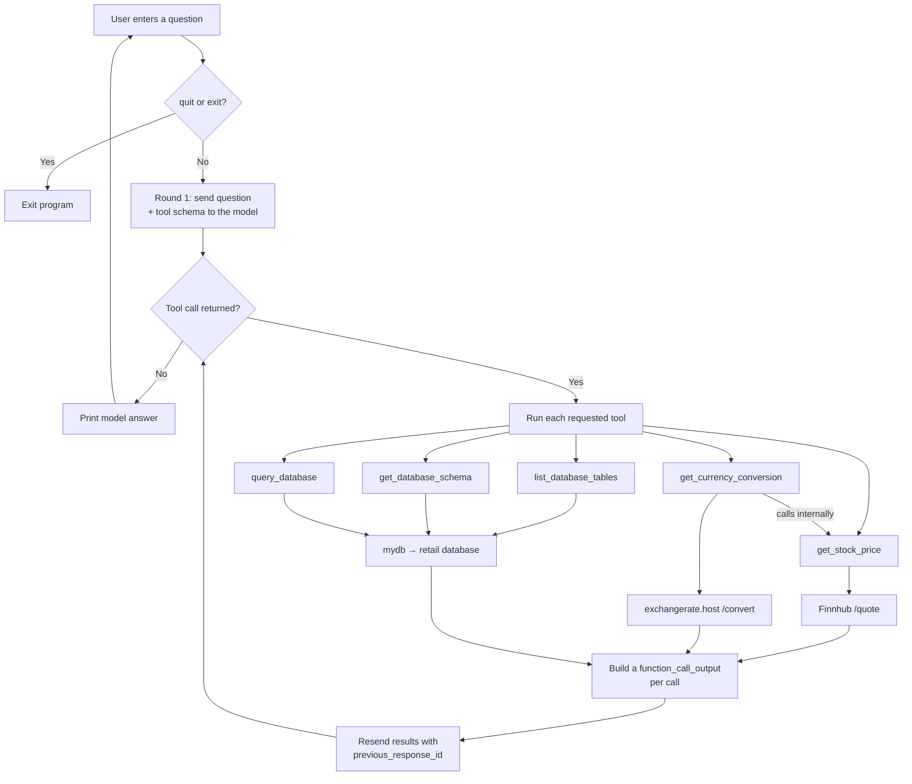
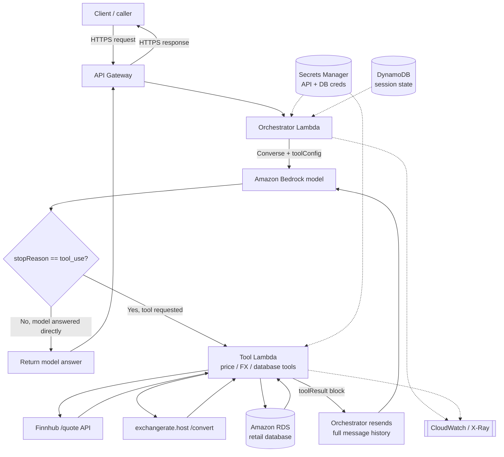
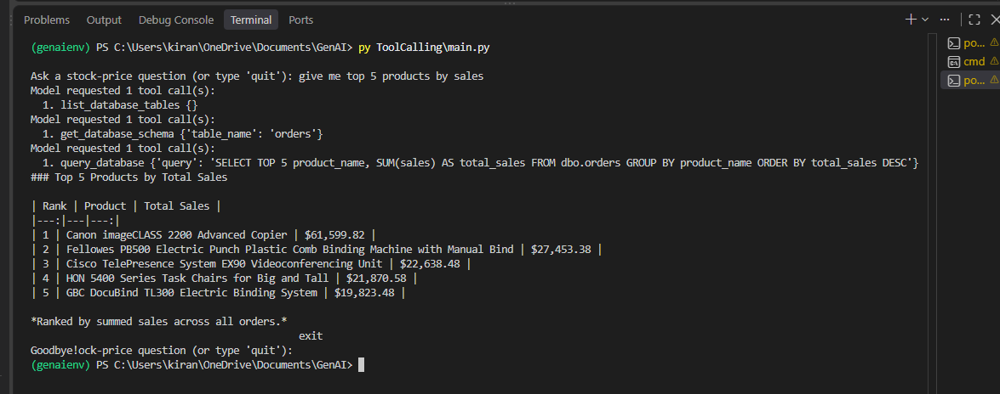
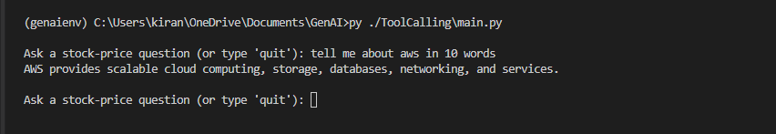

# Stock Price Tool Calling

A command-line example of tool calling with the OpenAI Responses API. In one loop
you can ask for a live stock price, the same price converted into another currency,
or natural-language questions about a retail SQL database. The model picks the right
tool (or tools), the script runs them, and the results go back to the model so it
can answer in plain language.

> The project started as a stock-price demo; it now also answers questions across a
> whole SQL database, so you may want to rename the repo accordingly.

## Features

- Interactive loop that handles multiple questions in one run
- Five tools: live USD stock price, currency conversion, table discovery, schema lookup, and read-only SQL query
- Function calling via the OpenAI Responses API
- Multi-round tool loop — keeps calling tools until the model returns plain text
- Live prices from Finnhub; currency conversion from exchangerate.host
- A discover → inspect → query flow over the retail database via a local `mydb` module
- Query guardrails that validate referenced tables against the live catalog
- Correct `function_call_output` and `call_id` handling
- Graceful handling of network errors, `Ctrl+C`, and `quit` / `exit`

## Architecture



### Request flow

1. The user asks a question — a stock price, a converted price, or something about the database.
2. `main.py` sends the question and the tool schema to the Responses API.
3. The model picks the appropriate tool. For a data question it usually works in steps: `list_database_tables` to find the right table, `get_database_schema` to learn its columns, then `query_database`.
4. The script runs each requested call locally. `get_currency_conversion` calls `get_stock_price` internally, then converts through exchangerate.host; the database tools go through the `mydb` module.
5. The script returns one `function_call_output` per call (each carrying its `call_id`) and resends them with `previous_response_id`.
6. Steps 3–5 repeat until the model stops requesting tools — this is the multi-round loop.
7. The model produces the final, readable answer.

## Code walkthrough

The whole program is one file, `main.py`. Here are the pieces that matter, in the
order the diagram follows.

### The price and currency tools

`get_stock_price` fetches a USD quote from Finnhub:

```python
def get_stock_price(ticker):
    try:
        response = requests.get(
            "https://finnhub.io/api/v1/quote",
            params={"symbol": ticker.upper(), "token": FINNHUB_API_KEY},
            timeout=10,
        )
        response.raise_for_status()
        data = response.json()

        price = data.get("c")           # "c" = current price
        if not price:                   # Finnhub returns 0 for unknown symbols
            return "Ticker not found"
        return price
    except requests.RequestException as e:
        return f"Error fetching price: {e}"
```

`get_currency_conversion` reuses it — it calls `get_stock_price` first, then
converts the USD price through exchangerate.host. Its first line is an ordinary
Python call, so a currency question is a *single* tool call from the model's point
of view but *two* HTTP calls under the hood (Finnhub, then exchangerate.host).

```python
def get_currency_conversion(ticker, currency):
    price = get_stock_price(ticker)     # <-- ordinary Python call to the tool above
    if isinstance(price, str):          # a str means it returned an error message
        return price
    try:
        response = requests.get(
            "https://api.exchangerate.host/convert",
            params={
                "access_key": EXCHANGERATE_API_KEY,
                "from": "USD",
                "to": currency.upper(),
                "amount": price,
            },
            timeout=10,
        )
        response.raise_for_status()
        data = response.json()
        # exchangerate.host returns {"success": false, ...} with a 200 status,
        # so check the body, not just the HTTP code.
        if not data.get("success", True) or data.get("result") is None:
            return f"Error converting price to {currency}: {data.get('error', 'no result')}"
        return data.get("result")
    except requests.RequestException as e:
        return f"Error converting price: {e}"
```

### The database tools

Three tools give the model read-only access to the retail database through a local
`mydb` module, imported from the workspace root:

```python
import sys
from pathlib import Path
sys.path.insert(0, str(Path(__file__).resolve().parents[1]))
from mydb import get_schema, get_tables, run_query
```

They form a **discover → inspect → query** chain. `list_database_tables` returns
every available `dbo` table so the model can find the right one:

```python
def list_database_tables():
    tables = get_tables()
    return tables.to_dict(orient="records")
```

`get_database_schema` returns the columns and types for a chosen table:

```python
def get_database_schema(table_name):
    schema = get_schema(table_name)
    return schema.to_dict(orient="records")
```

`query_database` runs a single SELECT, but first extracts the tables named in
`FROM`/`JOIN` and rejects any that aren't in the live catalog:

```python
def query_database(query):
    table_references = re.findall(
        r"\b(?:FROM|JOIN)\s+(?:\[?dbo\]?\.)?\[?([A-Za-z_][\w]*)\]?",
        query, flags=re.IGNORECASE,
    )
    if not table_references:
        raise ValueError("The query must reference at least one table.")

    available_tables = {row["TABLE_NAME"].lower() for row in list_database_tables()}
    unknown = {t.lower() for t in table_references if t.lower() not in available_tables}
    if unknown:
        raise ValueError(
            f"Unknown table(s): {', '.join(sorted(unknown))}. Use list_database_tables first."
        )

    results = run_query(query)
    return results.to_dict(orient="records")
```

**Three-step database pattern.** For a data question the model typically calls
`list_database_tables`, then `get_database_schema` on the table it wants, then
`query_database` — three rounds handled naturally by the loop. Rows can contain
dates and decimals, so results are serialized with `json.dumps(result, default=str)`.

**Guardrail caveats.** The check validates *table names* against the live catalog,
not *statement type* — a write that targets an existing table (for example
`DELETE FROM orders ...`) still matches `FROM orders` and passes. Enforce read-only
at the database (a `SELECT`-only user or a read replica) and treat the regex as
defense-in-depth. Two more notes: `query_database` calls `list_database_tables` on
every query (an extra DB round-trip you could cache), and all three database tools
**raise** on failure — those exceptions are not caught in the dispatch loop, so they
stop the program unless you wrap the dispatch body in `try/except`.

### The tool schema

Each tool is described so the model can tell them apart, and the database
descriptions steer the discover → inspect → query order. The stock and currency
entries are as before; the three database entries are:

```python
{
    "type": "function",
    "name": "list_database_tables",
    "description": (
        "List all available user tables in the dbo schema. Use this first for "
        "database questions when the relevant table is unknown."
    ),
    "parameters": {"type": "object", "properties": {}, "required": []},
},
{
    "type": "function",
    "name": "get_database_schema",
    "description": (
        "Get the column names and data types for a table. Use list_database_tables "
        "first when the table is unknown, then inspect it before querying."
    ),
    "parameters": {
        "type": "object",
        "properties": {
            "table_name": {"type": "string", "description": "Exact name from list_database_tables."}
        },
        "required": ["table_name"],
    },
},
{
    "type": "function",
    "name": "query_database",
    "description": (
        "Run exactly one read-only SQL SELECT and return matching rows. Use only "
        "tables discovered with list_database_tables. Do not generate INSERT, "
        "UPDATE, DELETE, DROP, ALTER, or multiple statements."
    ),
    "parameters": {
        "type": "object",
        "properties": {
            "query": {"type": "string", "description": "One SELECT over known tables."}
        },
        "required": ["query"],
    },
},
```

### The interactive loop

The outer loop reads questions; the inner loop runs tool rounds until the model
returns text.

```python
while True:
    try:
        question = input("\nAsk a stock-price question (or type 'quit'): ").strip()
    except (EOFError, KeyboardInterrupt):
        print("\nGoodbye!")
        break

    if question.lower() in {"quit", "exit"}:
        print("Goodbye!")
        break
    if not question:
        continue
    # ... Round 1 + the tool loop below ...
```

### Round 1 — ask the question

```python
response = client.responses.create(
    model="gpt-5.6-sol",
    input=question,
    tools=my_tools,
)
response_id = response.id
```

### The tool loop — run, resend, repeat

The inner loop checks for tool calls. With none, it prints the answer and breaks.
Otherwise it runs every requested tool, resends the outputs, updates `response_id`,
and loops again. Reassigning `response_id` each round keeps every follow-up chained
to the response that made the request.

```python
while True:
    function_calls = [
        item for item in response.output if item.type == "function_call"
    ]

    if not function_calls:
        print(response.output_text)
        break

    tool_output = []
    for tool_call in function_calls:
        call_args = json.loads(tool_call.arguments)
        if tool_call.name == "get_stock_price":
            result = {"stock_price": get_stock_price(call_args["ticker"])}
        elif tool_call.name == "get_currency_conversion":
            result = {"converted_price": get_currency_conversion(
                call_args["ticker"], call_args["currency"])}
        elif tool_call.name == "get_database_schema":
            result = {"schema": get_database_schema(call_args["table_name"])}
        elif tool_call.name == "list_database_tables":
            result = {"tables": list_database_tables()}
        elif tool_call.name == "query_database":
            result = {"rows": query_database(call_args["query"])}
        else:
            result = {"error": f"Unknown function: {tool_call.name}"}

        tool_output.append(
            {
                "type": "function_call_output",
                "call_id": tool_call.call_id,
                "output": json.dumps(result, default=str),   # dates/decimals → str
            }
        )

    if not tool_output:
        print("No tool output was produced; unable to continue this request.")
        break

    response = client.responses.create(
        model="gpt-5.6-sol",
        input=tool_output,
        previous_response_id=response_id,
        tools=my_tools,
    )
    response_id = response.id
```

## Running on AWS

The same tool-calling loop — including the multi-round behaviour — works unchanged
as a serverless app. You are only relocating each local piece into a managed
service; the control flow is identical.

### Local component → AWS service

| Local script | AWS equivalent |
| --- | --- |
| CLI `while` loop | Client calling **API Gateway** (or a Lambda Function URL) |
| `main.py` orchestration | **Orchestrator Lambda** running the tool-calling loop |
| OpenAI Responses API | **Amazon Bedrock** Converse API (native tool use) — or call OpenAI over HTTPS from the Lambda |
| Tool functions (price, FX, list / schema / query) | **Tool Lambda(s)** (registered as Bedrock action groups) |
| Finnhub + exchangerate.host calls | Unchanged — external HTTPS from the Tool Lambda(s) |
| `mydb` retail database | **Amazon RDS** (or your managed SQL DB), queried by the Tool Lambda inside the VPC |
| `.env` keys | **Secrets Manager** (or SSM Parameter Store) — including the DB credentials |
| `previous_response_id` state | **DynamoDB** session table (or a Bedrock Agent session) |
| `print(output_text)` | HTTP response returned through API Gateway |
| — | **CloudWatch Logs / X-Ray** for logging and tracing |

A tool that chains calls — like `get_currency_conversion` calling `get_stock_price`
then exchangerate.host — maps to a single Tool Lambda making both downstream calls.
The database tools query RDS from within the VPC.

### Architecture



### Two ways to build it

**A. Self-managed loop (closest to this project).** The Orchestrator Lambda runs
the same loop, calling Bedrock's `Converse` API with a `toolConfig`. Bedrock returns
`stopReason == "tool_use"` with a `toolUse` block instead of an OpenAI
`function_call`; you invoke the Tool Lambda, append a `toolResult` block, and call
`Converse` again — repeating until it stops requesting tools. The mapping is direct:
`toolUseId` ≈ `call_id`, `toolResult` ≈ `function_call_output`.

Bedrock's `Converse` API is **stateless**: there is no `previous_response_id`, so
you pass the full `messages` history on every call, and DynamoDB holds session state
for multi-turn conversations.

**B. Bedrock Agents (managed orchestration).** Define an agent with action groups
for the five tools, backed by the Tool Lambda(s). The agent runs the reason-and-call
loop for you, so the orchestrator code mostly disappears — less code to own, less
control over the loop.

### Security & production notes

- **Enforce read-only at the database, not in code.** Now that the tools span the whole database, give the Tool Lambda's DB user a `SELECT`-only grant on the tables (or a read replica / curated views). The regex table-name check validates *which* tables a query touches, not *whether* it writes — so it is defense-in-depth, never the primary control. Add a statement timeout to bound expensive queries.
- **Egress:** the Tool Lambda's calls to Finnhub and exchangerate.host go out through a NAT Gateway; RDS is reached privately inside the VPC. Use VPC (PrivateLink) endpoints for Bedrock, Secrets Manager, and DynamoDB so that traffic stays on the AWS network.
- **Secrets:** keep API keys *and* database credentials in Secrets Manager with rotation enabled; never bake them into code or environment variables.
- **IAM:** least-privilege roles per Lambda — the Orchestrator needs `bedrock:InvokeModel` and `lambda:InvokeFunction`; the Tool Lambda needs only its secrets and RDS connectivity.
- **Resilience & cost:** set Lambda timeouts and retries, handle Bedrock throttling with backoff, and cap the tool loop so a runaway can't spin forever. Consider caching the table list rather than re-reading it on every query.
- **Model choice:** using Bedrock keeps prompts and responses inside your AWS account and region. To keep the exact OpenAI model instead, only the "brain" box changes — the Orchestrator Lambda calls the OpenAI Responses API over HTTPS and the rest is unchanged.

## Project structure

```text
GenAI/                       # workspace root
├── mydb.py                  # database helpers: get_tables, get_schema, run_query
├── requirements.txt
├── genaienv/                # virtual environment
└── ToolCalling/
    ├── main.py              # interactive tool-calling application
    ├── main_notebook.ipynb  # notebook version of the example
    └── README.md            # this file
```

`main.py` adds the workspace root to `sys.path` so it can import `mydb`, which owns
the database connection.

## Requirements

- Python 3.10 or newer
- An OpenAI API key
- A Finnhub API token
- An exchangerate.host API key (for currency conversion)
- A SQL database with a `dbo` schema, reachable by the `mydb` module
- Internet access

Dependencies are listed in the workspace-level `requirements.txt`:

- `openai`
- `python-dotenv`
- `requests`

The database tools also rely on the workspace `mydb` module and whatever it needs to
connect — typically `pandas` plus a SQL driver (for example `pyodbc` for SQL Server).

## Setup

From the workspace root, create and activate a virtual environment, then install
the dependencies.

**Windows (PowerShell)**

```powershell
python -m venv genaienv
.\genaienv\Scripts\Activate.ps1
pip install -r requirements.txt
```

**macOS / Linux**

```bash
python3 -m venv genaienv
source genaienv/bin/activate
pip install -r requirements.txt
```

Create a `.env` file in the workspace root:

```env
OPENAI_API_KEY=your_openai_api_key
FINNHUB_API_KEY=your_finnhub_api_token
EXCHANGERATE_API_KEY=your_exchangerate_host_key
```

Add any database connection settings your `mydb` module expects here too. The
`EXCHANGERATE_API_KEY` is only needed for currency conversion (free tier ~100
requests/month at exchangerate.host). Do not commit `.env` or expose any key.

## Run

From the workspace root:

```powershell
python ToolCalling\main.py
```

Example questions:

```text
What is the stock price of Apple?
Give me Microsoft's price in Indian rupees
What tables are in the database?
Show the 5 most recent orders
How many orders were placed this month?
```

To stop, type `quit` or `exit`, press `Ctrl+C`, or send EOF.

## Configuration

The model is set in `main.py`:

```python
model="gpt-5.6-sol"
```

The tool schema exposes five functions: `get_stock_price(ticker)`,
`get_currency_conversion(ticker, currency)`, `list_database_tables()`,
`get_database_schema(table_name)`, and `query_database(query)`. To add more tools,
add their schemas to `my_tools` and handle their dispatch in the tool loop.

## Error handling

- Unknown or unavailable tickers return `Ticker not found`.
- Finnhub or exchangerate.host failures are returned as readable tool results rather than crashing the loop.
- exchangerate.host returns `{"success": false}` with a 200 status, so the body is checked, not just the HTTP code.
- The database tools **raise** `ValueError` on a guardrail violation (a query with no table, or one referencing a table not in the live catalog). These exceptions are not caught in the dispatch loop today, so they stop the program; wrap the dispatch body in `try/except` if you want the model to see and recover from them.
- Empty questions are ignored, and a round that yields no tool output is reported and ends.
- The tool loop runs until the model returns plain text, executing every requested call in each round.

## Responses API notes

A few details the script depends on:

- Filter on `item.type == "function_call"` to skip reasoning items.
- Use `tool_call.call_id` (not `tool_call.id`) to identify each call.
- Return results as `function_call_output` items whose `output` is JSON text (`default=str` handles dates and decimals from the database).
- Chain each follow-up request with `previous_response_id`, updating it every round.

Using `tool_call.id` in place of `call_id`, or sending a plain string instead of
a `function_call_output` item, will cause the API to reject the follow-up request.


## Execution





## When No tool calls; model will answer the question directly




