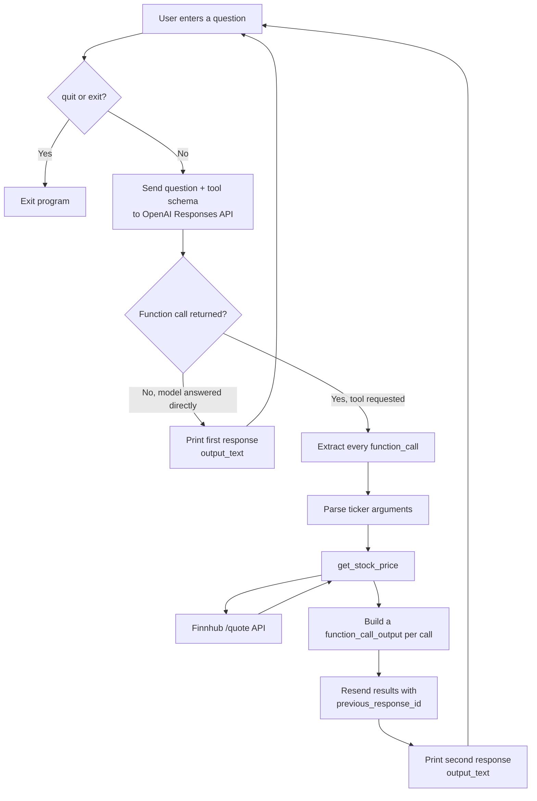
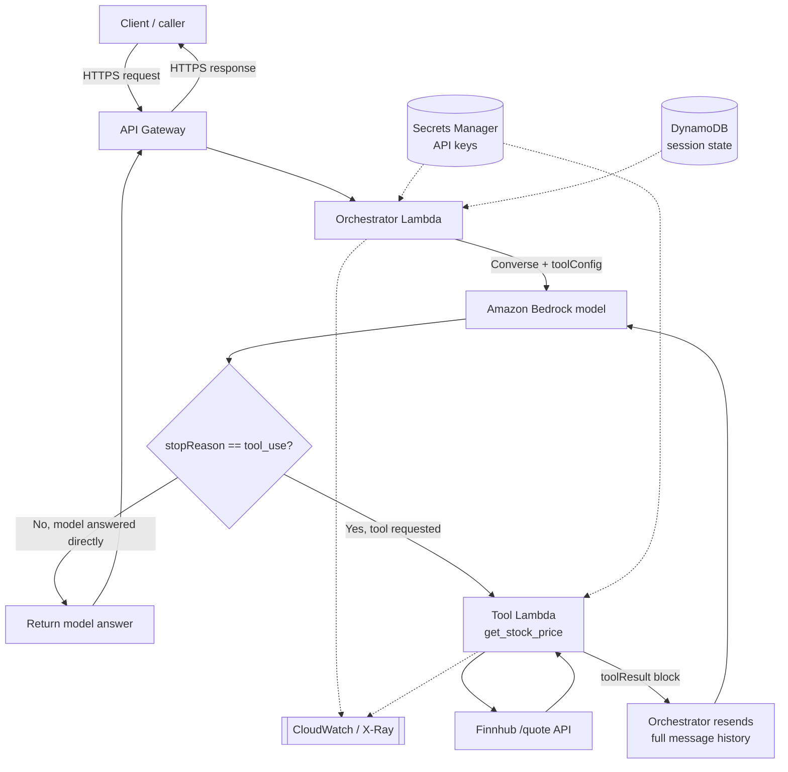

# Stock Price Tool Calling

A command-line example of tool calling with the OpenAI Responses API. You ask
stock-price questions in a loop; the model decides whether the stock-price tool
is needed, the script fetches live prices from Finnhub, and the results are sent
back to the model so it can answer in plain language.

## Features

- Interactive loop that handles multiple questions in one run
- Function calling via the OpenAI Responses API
- Live stock prices from Finnhub
- Handles multiple function calls in a single model response
- Correct `function_call_output` and `call_id` handling
- Graceful handling of network errors, `Ctrl+C`, and `quit` / `exit`

## Architecture



### Request flow

1. The user asks something like `What is the stock price of Microsoft?`.
2. `main.py` sends the question and the tool schema to the Responses API.
3. When a price lookup is needed, the model returns one or more `function_call` items.
4. The script runs each requested call locally.
5. `get_stock_price` fetches the current quote from Finnhub.
6. The script returns one `function_call_output` per call, each carrying its matching `call_id`.
7. Those results are submitted back with `previous_response_id`.
8. The model produces the final, readable answer.

## Code walkthrough

The whole program is one file, `main.py`. Here are the pieces that matter, in the
order the diagram follows.

### The tool: `get_stock_price`

The only function the model can trigger. It takes a ticker, calls Finnhub, and
returns either the current price or a readable error string.

```python
def get_stock_price(ticker):
    try:
        response = requests.get(
            "https://finnhub.io/api/v1/quote",
            params={"symbol": ticker.upper(), "token": FINNHUB_API_KEY},
            timeout=10,                 # don't hang forever on a slow network
        )
        response.raise_for_status()     # turn 401/429/500 into exceptions
        data = response.json()

        price = data.get("c")           # "c" = current price
        if not price:                   # Finnhub returns 0 for unknown symbols
            return "Ticker not found"
        return price
    except requests.RequestException as e:
        return f"Error fetching price: {e}"
```

### The tool schema

The model never sees the function body — only this description, which tells it the
name, purpose, and arguments.

```python
my_tools = [
    {
        "type": "function",
        "name": "get_stock_price",
        "description": "Get the stock price of a given ticker symbol.",
        "parameters": {
            "type": "object",
            "properties": {
                "ticker": {
                    "type": "string",
                    "description": "The ticker symbol of the stock.",
                }
            },
            "required": ["ticker"],
        },
    }
]
```

### The interactive loop

Each iteration reads a question, runs the two rounds, and prints the answer.
`quit`/`exit`, `Ctrl+C`, and EOF all end the loop; blank input is skipped.

```python
while True:
    try:
        question = input("\nAsk a stock-price question (or type 'quit'): ").strip()
    except (EOFError, KeyboardInterrupt):
        print("\nGoodbye!")
        break

    if question.lower() in {"quit", "exit"}:
        print("Goodbye!")
        break
    if not question:
        continue
    # ... two rounds below ...
```

### Round 1 — ask, then check for a tool call

```python
response = client.responses.create(
    model="gpt-5.6-sol",
    input=question,
    tools=my_tools,
)

response_id = response.id
function_calls = [
    item for item in response.output if item.type == "function_call"
]

# No tool needed → the model already answered (the "No" branch of the diagram).
if not function_calls:
    print(response.output_text)
    continue
```

### Run the tools

Every requested call is executed, and each result is tagged with its `call_id`.

```python
tool_output = []
for tool_call in function_calls:
    call_args = json.loads(tool_call.arguments)
    if tool_call.name == "get_stock_price":
        result = get_stock_price(call_args["ticker"])
    else:
        result = {"error": f"Unknown function: {tool_call.name}"}

    tool_output.append(
        {
            "type": "function_call_output",
            "call_id": tool_call.call_id,
            "output": json.dumps({"stock_price": result}),
        }
    )
```

### Round 2 — send results back, get the final answer

`previous_response_id` links this call to Round 1, so the model remembers the
original question without resending it.

```python
response = client.responses.create(
    model="gpt-5.6-sol",
    input=tool_output,
    previous_response_id=response_id,
    tools=my_tools,
)

print(response.output_text)
```

## Running on AWS

The same two-round tool-calling loop works unchanged as a serverless app. You are
only relocating each local piece into a managed service — the control flow (ask the
model, run the tool if requested, feed the result back, return the answer) is
identical.

### Local component → AWS service

| Local script | AWS equivalent |
| --- | --- |
| CLI `while` loop | Client calling **API Gateway** (or a Lambda Function URL) |
| `main.py` orchestration | **Orchestrator Lambda** running the tool-calling loop |
| OpenAI Responses API | **Amazon Bedrock** Converse API (native tool use) — or call OpenAI over HTTPS from the Lambda |
| `get_stock_price` function | **Tool Lambda** (registered as a Bedrock action group) |
| Finnhub `/quote` call | Unchanged — external HTTPS request from the Tool Lambda |
| `.env` keys | **Secrets Manager** (or SSM Parameter Store) |
| `previous_response_id` state | **DynamoDB** session table (or a Bedrock Agent session) |
| `print(output_text)` | HTTP response returned through API Gateway |
| — | **CloudWatch Logs / X-Ray** for logging and tracing |

### Architecture



### Two ways to build it

**A. Self-managed loop (closest to this project).** The Orchestrator Lambda runs
the same loop you have now, calling Bedrock's `Converse` API with a `toolConfig`.
Bedrock returns `stopReason == "tool_use"` with a `toolUse` block instead of an
OpenAI `function_call`; you invoke the Tool Lambda, append a `toolResult` block,
and call `Converse` again for the final text. The mapping is direct:
`toolUseId` ≈ `call_id`, `toolResult` ≈ `function_call_output`.

One difference worth noting: Bedrock's `Converse` API is **stateless**. There is no
`previous_response_id` — you pass the full `messages` history on every call, which
is why the diagram loops back with "resend full message history" and why DynamoDB
holds session state for multi-turn conversations.

The same two rounds in Bedrock look like this — note that `toolConfig` replaces
`my_tools`, `stopReason == "tool_use"` replaces the `function_call` check, and the
full `messages` list is resent on Round 2:

```python
import boto3

bedrock = boto3.client("bedrock-runtime")

tool_config = {
    "tools": [
        {
            "toolSpec": {
                "name": "get_stock_price",
                "description": "Get the stock price of a given ticker symbol.",
                "inputSchema": {
                    "json": {
                        "type": "object",
                        "properties": {
                            "ticker": {"type": "string", "description": "The ticker symbol."}
                        },
                        "required": ["ticker"],
                    }
                },
            }
        }
    ]
}

messages = [{"role": "user", "content": [{"text": question}]}]

# Round 1
resp = bedrock.converse(modelId=MODEL_ID, messages=messages, toolConfig=tool_config)

if resp["stopReason"] == "tool_use":
    messages.append(resp["output"]["message"])          # keep the assistant turn
    tool_results = []
    for block in resp["output"]["message"]["content"]:
        if "toolUse" in block:
            tu = block["toolUse"]                        # toolUseId ≈ call_id
            price = get_stock_price(tu["input"]["ticker"])
            tool_results.append({
                "toolResult": {
                    "toolUseId": tu["toolUseId"],
                    "content": [{"json": {"stock_price": price}}],
                }
            })
    messages.append({"role": "user", "content": tool_results})

    # Round 2 — resend the whole history (Converse keeps no server-side state)
    resp = bedrock.converse(modelId=MODEL_ID, messages=messages, toolConfig=tool_config)

print(resp["output"]["message"]["content"][0]["text"])
```

**B. Bedrock Agents (managed orchestration).** Define an agent with an action group
whose schema is `get_stock_price`, backed by the Tool Lambda. The agent runs the
reason-and-call loop for you, so the orchestrator code mostly disappears. Less code
to own, less control over the loop.

### AWS request flow (self-managed)

1. The client sends a question to API Gateway.
2. API Gateway invokes the Orchestrator Lambda.
3. The Lambda pulls API keys from Secrets Manager and calls Bedrock with the tool schema.
4. If `stopReason == "tool_use"`, the Lambda invokes the Tool Lambda for each requested call.
5. The Tool Lambda fetches the quote from Finnhub and returns it.
6. The Orchestrator appends a `toolResult` per call and re-calls Bedrock with the full history.
7. Bedrock returns the final answer, which is sent back through API Gateway to the client.

### Production notes

- **Egress:** in a locked-down (VPC) setup, the Tool Lambda's outbound call to Finnhub goes through a NAT Gateway; reach Bedrock, Secrets Manager, and DynamoDB over VPC (PrivateLink) endpoints so that traffic stays on the AWS network.
- **Secrets:** enable rotation on the Secrets Manager entries; never bake keys into environment variables or code.
- **IAM:** give each Lambda least-privilege roles — the Orchestrator needs `bedrock:InvokeModel` and `lambda:InvokeFunction`; the Tool Lambda needs only its Finnhub secret.
- **Resilience & cost:** set Lambda timeouts and retries, and handle Bedrock throttling with backoff. Watch per-invocation model cost the same way you'd watch API rate limits locally.
- **Model choice:** using Bedrock keeps prompts and responses inside your AWS account and region. If you need the exact OpenAI model instead, only the "brain" box changes — the Orchestrator Lambda calls the OpenAI Responses API over HTTPS and the rest of the architecture is unchanged.

## Project structure

```text
ToolCalling/
├── main.py                 # Interactive tool-calling application
├── main_notebook.ipynb     # Notebook version of the example
└── README.md               # Project documentation
```

## Requirements

- Python 3.10 or newer
- An OpenAI API key
- A Finnhub API token
- Internet access

Dependencies are listed in the workspace-level `requirements.txt`:

- `openai`
- `python-dotenv`
- `requests`

## Setup

From the workspace root, create and activate a virtual environment, then install
the dependencies.

**Windows (PowerShell)**

```powershell
python -m venv genaienv
.\genaienv\Scripts\Activate.ps1
pip install -r requirements.txt
```

**macOS / Linux**

```bash
python3 -m venv genaienv
source genaienv/bin/activate
pip install -r requirements.txt
```

Create a `.env` file in the workspace root:

```env
OPENAI_API_KEY=your_openai_api_key
FINNHUB_API_KEY=your_finnhub_api_token
```

Do not commit `.env` or expose either key in source control.

## Run

From the workspace root:

```powershell
python ToolCalling\main.py
```

The program shows a prompt:

```text
Ask a stock-price question (or type 'quit'):
```

Example questions:

```text
What is the stock price of Apple?
What is Microsoft trading at?
How much is Google stock?
```

To stop, type `quit` or `exit`, press `Ctrl+C`, or send EOF.

## Configuration

The model is set in `main.py`:

```python
model="gpt-5.6-sol"
```

The tool schema currently exposes a single function, `get_stock_price(ticker)`.
To add more tools, add their schemas to `my_tools` and handle their dispatch in
the tool-execution loop.

## Error handling

- Unknown or unavailable tickers return `Ticker not found`.
- Finnhub request failures are returned as readable tool results rather than crashing the loop.
- Empty questions are ignored.
- Questions that don't need a tool are answered directly by the model.
- When the model requests several function calls, all of them are executed and returned before the final answer is requested.

## Responses API notes

A few details the script depends on:

- Filter on `item.type == "function_call"` to skip reasoning items.
- Use `tool_call.call_id` (not `tool_call.id`) to identify each call.
- Return results as `function_call_output` items whose `output` is JSON text.
- Chain the follow-up request with `previous_response_id`.

Using `tool_call.id` in place of `call_id`, or sending a plain string instead of
a `function_call_output` item, will cause the API to reject the follow-up request.