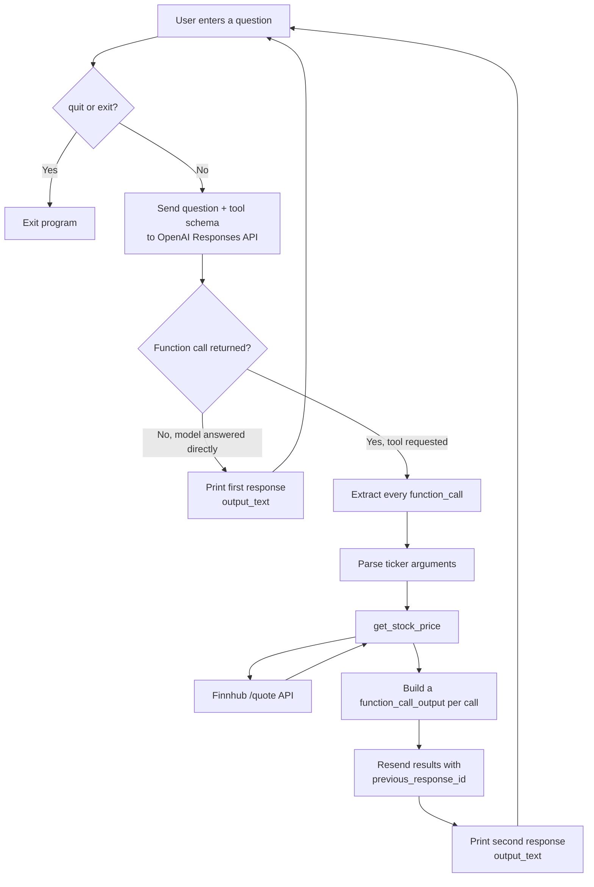

# Stock Price Tool Calling

A command-line example of tool calling with the OpenAI Responses API. You ask
stock-price questions in a loop; the model decides whether the stock-price tool
is needed, the script fetches live prices from Finnhub, and the results are sent
back to the model so it can answer in plain language.

## Features

- Interactive loop that handles multiple questions in one run
- Function calling via the OpenAI Responses API
- Live stock prices from Finnhub
- Handles multiple function calls in a single model response
- Correct `function_call_output` and `call_id` handling
- Graceful handling of network errors, `Ctrl+C`, and `quit` / `exit`

## Architecture



### Request flow

1. The user asks something like `What is the stock price of Microsoft?`.
2. `main.py` sends the question and the tool schema to the Responses API.
3. When a price lookup is needed, the model returns one or more `function_call` items.
4. The script runs each requested call locally.
5. `get_stock_price` fetches the current quote from Finnhub.
6. The script returns one `function_call_output` per call, each carrying its matching `call_id`.
7. Those results are submitted back with `previous_response_id`.
8. The model produces the final, readable answer.

## Project structure

```text
ToolCalling/
├── main.py                 # Interactive tool-calling application
├── main_notebook.ipynb     # Notebook version of the example
└── README.md               # Project documentation
```

## Requirements

- Python 3.10 or newer
- An OpenAI API key
- A Finnhub API token
- Internet access

Dependencies are listed in the workspace-level `requirements.txt`:

- `openai`
- `python-dotenv`
- `requests`

## Setup

From the workspace root, create and activate a virtual environment, then install
the dependencies.

**Windows (PowerShell)**

```powershell
python -m venv genaienv
.\genaienv\Scripts\Activate.ps1
pip install -r requirements.txt
```

**macOS / Linux**

```bash
python3 -m venv genaienv
source genaienv/bin/activate
pip install -r requirements.txt
```

Create a `.env` file in the workspace root:

```env
OPENAI_API_KEY=your_openai_api_key
FINNHUB_API_KEY=your_finnhub_api_token
```

Do not commit `.env` or expose either key in source control.

## Run

From the workspace root:

```powershell
python ToolCalling\main.py
```

The program shows a prompt:

```text
Ask a stock-price question (or type 'quit'):
```

Example questions:

```text
What is the stock price of Apple?
What is Microsoft trading at?
How much is Google stock?
```

To stop, type `quit` or `exit`, press `Ctrl+C`, or send EOF.

## Configuration

The model is set in `main.py`:

```python
model="gpt-5.6-sol"
```

The tool schema currently exposes a single function, `get_stock_price(ticker)`.
To add more tools, add their schemas to `my_tools` and handle their dispatch in
the tool-execution loop.

## Error handling

- Unknown or unavailable tickers return `Ticker not found`.
- Finnhub request failures are returned as readable tool results rather than crashing the loop.
- Empty questions are ignored.
- Questions that don't need a tool are answered directly by the model.
- When the model requests several function calls, all of them are executed and returned before the final answer is requested.

## Responses API notes

A few details the script depends on:

- Filter on `item.type == "function_call"` to skip reasoning items.
- Use `tool_call.call_id` (not `tool_call.id`) to identify each call.
- Return results as `function_call_output` items whose `output` is JSON text.
- Chain the follow-up request with `previous_response_id`.

Using `tool_call.id` in place of `call_id`, or sending a plain string instead of
a `function_call_output` item, will cause the API to reject the follow-up request.