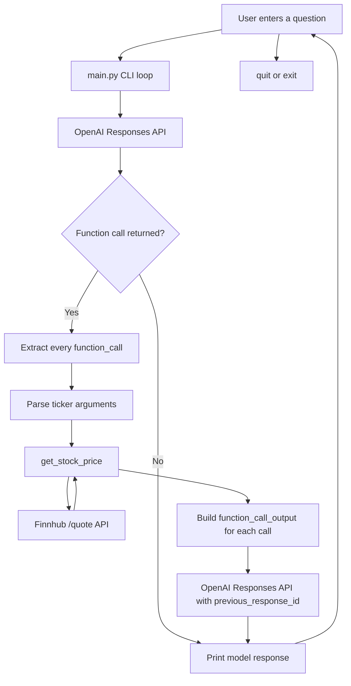

# Stock Price Tool Calling

A command-line example of OpenAI Responses API tool calling. The program accepts stock-price questions continuously, asks the model to decide whether the stock-price tool is needed, retrieves live prices from Finnhub, and sends the tool results back to the model for a natural-language answer.

## Features

- Interactive `while` loop for multiple questions in one run
- OpenAI Responses API function calling
- Live stock prices from Finnhub
- Support for multiple function calls in one model response
- Correct `function_call_output` and `call_id` handling
- Graceful handling of network errors, `Ctrl+C`, and `quit`/`exit`

## Architecture



### Request flow

1. The user enters a question such as `What is the stock price of Microsoft?`.
2. `main.py` sends the question and the tool schema to the OpenAI Responses API.
3. The model returns one or more `function_call` items when a price lookup is needed.
4. The script executes each requested call locally.
5. `get_stock_price` requests the current quote from Finnhub.
6. The script returns one `function_call_output` item per call using the matching `call_id`.
7. The tool results are submitted with `previous_response_id`.
8. The model produces the final readable answer.

## Project structure

```text
ToolCalling/
├── main.py                 # Interactive tool-calling application
├── main_notebook.ipynb     # Notebook version of the example
└── README.md               # Project documentation
```

## Requirements

- Python 3.10 or newer
- An OpenAI API key
- A Finnhub API token
- Internet access

The required packages are listed in the workspace-level `requirements.txt` file. This project uses:

- `openai`
- `python-dotenv`
- `requests`

## Setup

From the workspace root, create and activate a virtual environment if needed:

### Windows PowerShell

```powershell
python -m venv genaienv
.\genaienv\Scripts\Activate.ps1
pip install -r requirements.txt
```

Create a `.env` file in the workspace root:

```env
OPENAI_API_KEY=your_openai_api_key
FINNHUB_API_KEY=your_finnhub_api_token
```

Do not commit `.env` or expose either key in source control.

## Run

From the workspace root:

```powershell
.\genaienv\Scripts\python.exe ToolCalling\main.py
```

Or, after activating the environment:

```powershell
python ToolCalling\main.py
```

The program displays a prompt:

```text
Ask a stock-price question (or type 'quit'):
```

Example questions:

```text
What is the stock price of Apple?
What is Microsoft trading at?
How much is Google stock?
```

Type `quit`, `exit`, press `Ctrl+C`, or send EOF to stop the program.

## Configuration

The OpenAI model is currently set in `main.py`:

```python
model="gpt-5.6-sol"
```

The tool schema currently exposes one function:

```text
get_stock_price(ticker)
```

To add more tools, add their schemas to `my_tools` and implement their dispatch logic in the tool execution loop.

## Error handling

- Unknown or unavailable tickers return `Ticker not found`.
- Finnhub request failures are returned as readable tool results.
- Empty questions are ignored.
- Questions that do not require a tool are answered directly by the model.
- Multiple function calls are all executed and returned before requesting the final model response.

## Important Responses API details

The script intentionally uses:

- `item.type == "function_call"` to ignore reasoning items.
- `tool_call.call_id` to identify the requested function call.
- `type: "function_call_output"` for tool results.
- `output` containing JSON text for the tool result.
- `previous_response_id` to continue the same response chain.

Using `tool_call.id` instead of `tool_call.call_id`, or sending a plain string instead of a `function_call_output` item, causes the API to reject the follow-up request.
